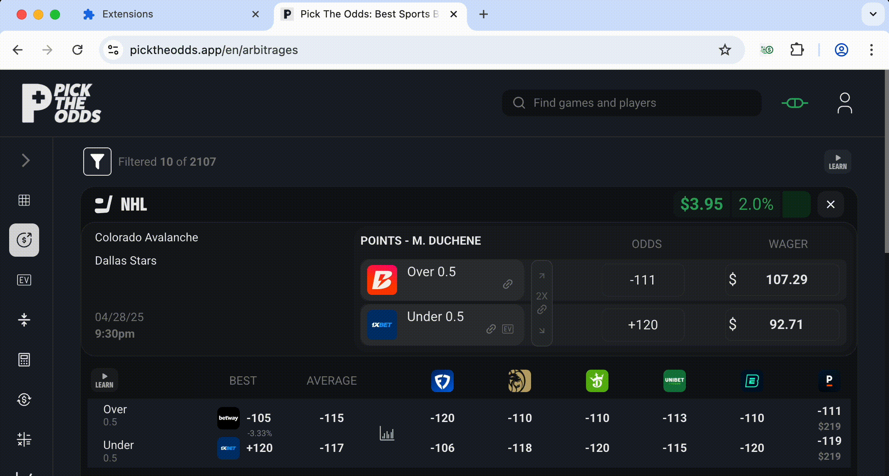
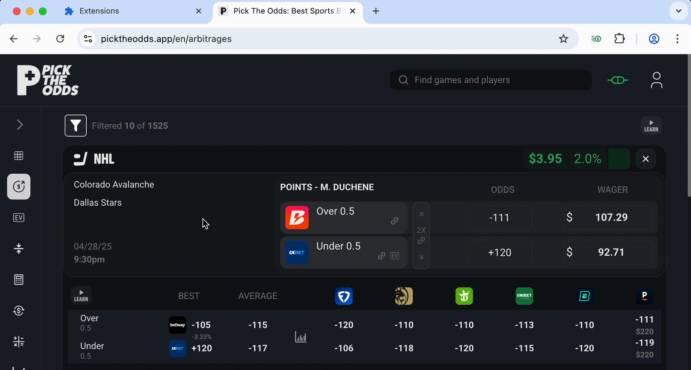
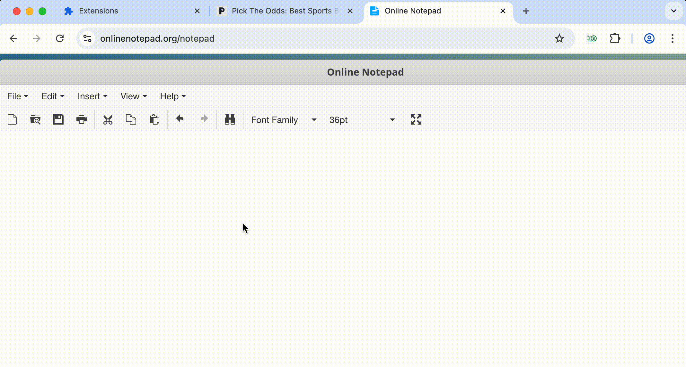

  

# QuickArb

Speed is crucial when placing arbitrage bets, as live odds can change rapidly. QuickArb is an arbitrage calculator Google Chrome extension. It is designed to 

1. Provide more information and configurability than arbitrage screening tools
2. Be used with hotkeys, allowing you to save valuable seconds by calculating the arbitrage without moving your cursor or navigating to a separate tab or window

## Features
- Calculate optimal bet sizes for arbitrage opportunities
- Display profits for each outcome

- Flexible weighting strategies:
  - Default mode ensures equal profit regardless of which outcome occurs
  - Optional "weighted" mode allocates bets to break even on the first odds while maximizing profit on the second odds.

- Round calculated wagers to the nearest 10. This provides less suspicious wager amounts

- Quick navigation with hotkeys and tabbing, without the need for point-and-click navigation
  - Tabbing is optimized for seamless data entry, automatically focusing on the next input field and triggering calculations.
  - Use `Ctrl + 1` to quickly copy the calculated bet size for Odds 1 to the clipboard.
  - Use `Ctrl + 2` to quickly copy the calculated bet size for Odds 2 to the clipboard.

## Usage

- **Opening and Closing the Extension**: Assign a custom hotkey in Chrome to open and close QuickArb instantly.
- **Navigating Input Fields**: Use the `Tab` key to move seamlessly between the odds input fields and trigger a calculation. QuickArb is optimized to automatically focus on the next logical field, ensuring a smooth data entry process.
- **Copying Values**: With `Ctrl + 1` and `Ctrl + 2`, you can quickly copy the calculated bet sizes for Odds 1 and Odds 2, respectively, directly to your clipboard.

By leveraging hotkeys, users can maximize the speed of their arbitrage betting placement. This method is significantly faster than traditional mouse navigation, as it reduces the time spent on manual actions.

## Local Installation
1. Open Chrome and navigate to `chrome://extensions/`.
2. Enable "Developer mode" in the top right corner.
3. Click "Load unpacked" and select the `extension` directory.
4. The extension should now be available in your browser.

## TODO
- Upload QuickArb to the Chrome Web Store:
  1. Create a developer account on the Chrome Web Store.
  2. Prepare the extension package, ensuring all necessary files are included.
  3. Follow the Chrome Web Store guidelines for uploading and publishing extensions.
  4. Set up a listing with a detailed description, screenshots, and any other required information.
  5. Submit the extension for review and address any feedback from the review process.

## Contributing
Contributions are welcome! Please read the [CONTRIBUTING.md](CONTRIBUTING.md) for guidelines.

## License
This project is licensed under the MIT License - see the [LICENSE](LICENSE) file for details. 